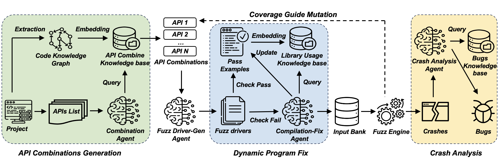

# CKGFuzzer


CKGFuzzer is an automated fuzzing framework that leverages large language models (LLMs) and a code knowledge graph to generate fuzz drivers. By automating the fuzz driver creation process and analyzing API usage, CKGFuzzer improves fuzzing efficiency, code coverage, and bug detection in complex software systems.

---

## Workflow




---

### 1. Preparation

Before running CKGFuzzer, ensure the following steps are completed:

1. **Ensure CodeQL is Installed**  
   Make sure that CodeQL is properly installed under the `docker_shared/` directory.

2. **API List**  
   Ensure that the API list (`api_list.json`) for the library to be tested is stored in the following path:
   ```
   /fuzzing_llm_engine/external_database/{project}/api_list.json
   ```

3. **Fuzzing Configuration**  
   Ensure that the fuzzing configuration (including your `API key` for LLM service) file (`config.yaml`) for the library is stored in the following path:  
   ```
   /fuzzing_llm_engine/external_database/{project}/config.yaml
   ```

4. **Library Environment**  
Ensure that the environment files (dockerfile etc.) for the library are stored in the following path:
    ```
    /fuzzing_llm_engine/projects/{project}/
    ```

5. **Library Usage**  
Prepare proper usage cases for the library to fix generated fuzz drivers and store them in the following folder:
    ```
    /fuzzing_llm_engine/external_database/{project}/test/
    ```

### 2. Extract Information from the Target Library

To extract the necessary information from the target library, such as source APIs and the call graph.

Navigate to the `fuzzing_llm_engine/repo` directory and run the `repo.py` script with the appropriate parameter:
```bash
cd fuzzing_llm_engine/repo
python repo.py --project_name {project} --shared_llm_dir /docker_shared --saved_dir /fuzzing_llm_engine/external_database/{project}/codebase --src_api --call_graph
```
Replace `{project}` with the name of the project you are testing.

### 3. Build External Knowledge Base 

After extracting the necessary information, build the external knowledge base for the target library by running the following command:
```bash
python preproc.py --project_name {project} --src_api_file_path /fuzzing_llm_engine/external_database/{project}
```
Replace `{project}` with the name of the project you are testing.


### 4. Run the Fuzzing Process

To run the fuzzing process, use the `fuzzing.py` script. You can skip certain steps by adding the `skip` prefix to the relevant parameters.

Run the fuzzing script with the following command:
```bash
cd ..
python fuzzing.py --yaml /fuzzing_llm_engine/external_database/{project}/config.yaml --gen_driver --summary_api --check_compilation --gen_input
```
**Skipping Steps**
If you want to skip certain steps, use the `--skip_*` options. For example:
```bash
python fuzzing.py --yaml /fuzzing_llm_engine/external_database/{project}/config.yaml --skip_gen_driver --skip_summary_api --skip_check_compilation --skip_gen_input
```
This command skips the fuzz driver generation and proceeds with the remaining steps.